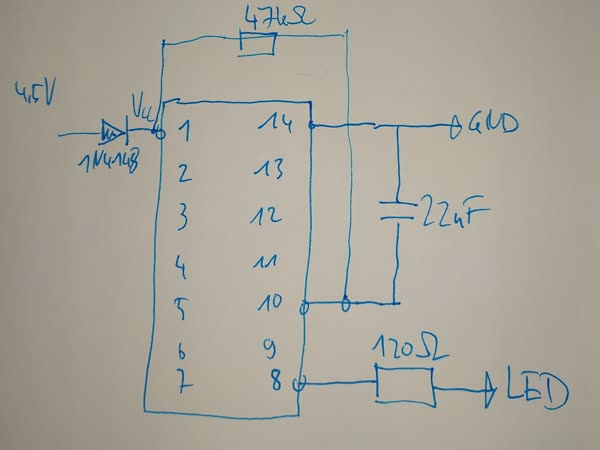

# Upcycle a festive IKEA table decoration to tell the temperature using morse code
## Problem
Last christmas i got an IKEA table decoration (Vinterfest J1865) which is a big chunk of clear plastic, very vaguely resembling a christmas tree. It contains a LED for illumination (to get a festive mood to the table  - i was told). I wasn't allowed to throw it away and decided to upcycle it instead to make it more bearable.. Of course you can use any other thing whith an LED for the same effect.

## Overview
### Old projects can be upcycled too!
In an old project, a MSP430 controller was used to tell the temperature using morse code. Combining this with the *Vintervest J1865*  a festive table thermometer can be created which uses the LED to morse the current temperature. So you have something to talk about and the plastic thing is upcyled. Also you can learn morse code and annoy your relatives at the same time :-) 

If the discussion heats up, it will be immediately noticed by the changing morse output.

### In action

That's 21° Celsius (di-di-dah-dah-dah di-dah-dah-dah-dah).

https://en.wikipedia.org/wiki/Morse_code

### Modification of the original project

The extra LED for negative temperature readings in the original project was left out because the thing is used only indoors. The IKEA LED was left in place and is connected to the microcontrollers output via a 120 Ohm resistor. It is really bright to get the readings across.

## Programming on the TI Launchpad

The project uses the msp430g2231 microcontroller which contains an internal thermometer. It is programmed on the *TI launchpad* - this is an Arduino like board, but the microcontroller is socketed. It can be removed from the board and transplanted to the IKEA Vinterfest after programming.

Programming is done with the Energia IDE (http://www.energia.nu), an Arduino IDE derivate for the TI MSP430 chips. Probably you can also use PlatformIO for the task.

### Voltage reduction, reset circuit, LED resistor

After programming with the arduino sketch, test it on the TI launchpad and adjust the parameters to your needs. Then the chip is removed and some extra parts are soldered to the pins:

* There are three 1.5V AA batteries in the base giving 4.5V. This is to much for the MSP430 chip, so a diode (1N4148) is added on the *Vcc* rail. The voltage drop across the diode is about 0.7V, so for the MSP430 are about 3.8V left. This is out of spec, but works fine for me... Or you can just use two batteries.

* Also a reset circuit is needed. Had a 22nF capacitor lying around, put it between pins 10 (Gnd) and 14 (RESET). A resistor (47kOhm in my case) was added between pin 1 (Vcc) and pin 14 to charge the capacitor after power-on.

* The big fat IKEA led gets its power through an 120 Ohm resistor on pin 8 of the microcontroller

## Modifying *IKEA Vinterfest*

It is not easy to get to the guts of the *IKEA Vinterfest*. I had success with drilling two holes in the bottom and prying out the base part. The base is pressed into the clear plastic, but not glued in - you have to use some force to get it out. It is basically a battery compartment with a LED on top. There is also a circuit which you have to  bypass - it is used to shut off the LED after 6 hours.

There is some white plastic on top, acting as reflector for the LED which have to be removed temporary. 

Base, with reflector, LED in center

### Putting it together, dead bug style

After the reflector is removed, there are some compartments visible in the base part. The soldered circuit can be squeezed into one of them in *dead bug* style and connected to the battery and switch. 

Base, reflector removed, circuit added

Check if it works, then add the reflector back. Last step is to fit the base part back into the clear plastic tree. You are ready to impress your family & friends!

## Links

Links
* https://www.ikea.lv/en/rooms/vinterfest-led-decoration-lighting-art-30429694
* You can find more information (in german) at http://www.µc.net/2015/03/morsethermometer-mit-msp430g2231.html
* https://www.ti.com/lit/ds/symlink/msp430g2231.pdf
* https://energia.nu/
* https://en.wikipedia.org/wiki/Morse_code
